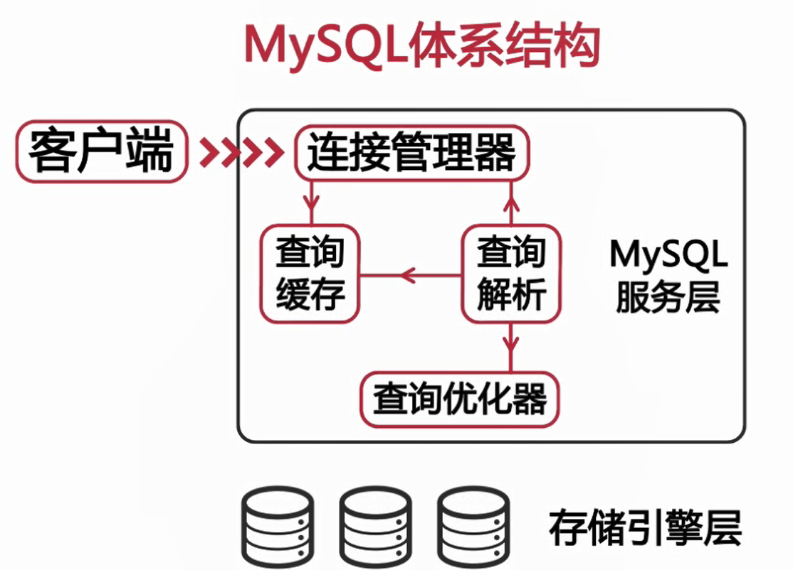
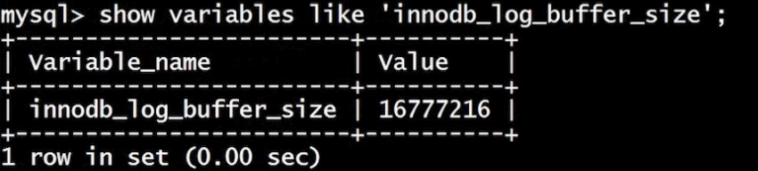
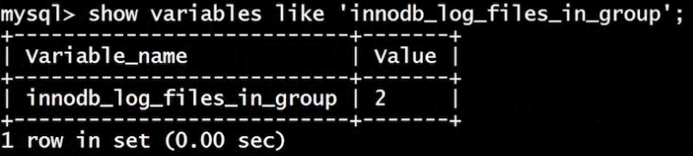
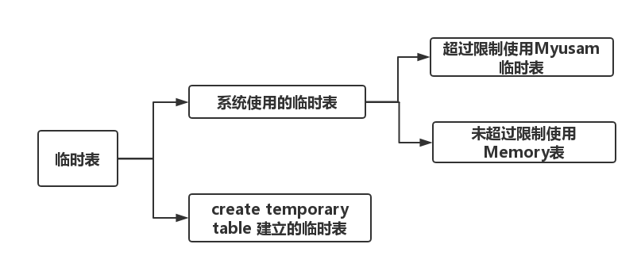

# 第二章：MySQL性能管理及架构设计-影响Mysql性能的因素


## 前言

> 本章主要介绍影响Mysql性能的一些因素以及一些性能优化的参数的配置


## 综述

1. cpu、内存、磁盘等硬件

2. 操作系统以及其参数优化

3. 数据库存储引擎的选择

   > MyISAM：不支持事务、表级锁
   >
   > InnoDB: 支持事务、行级锁、事务的ACID特性

4. 数据库参数配置

5. 数据库表结构设计、sql语句的编写

## CentOS 系统参数优化

### 内核相关参数(/etc/sysctl.conf)

> 相关参数直接增加到文件末尾

1. 每个端口最大的监听队列长度：net.core.somaxconn =65535（>2048）

2. net.core.netdev_max_backlog = 65535

   > 三次握手后网络端口由监听状态变成可连接状态，每个网络接口接受数据包的速率比内核处理数据包的速率快的时候，允许被发送到队列中的数据包的数目

3. net.ipv4.tcp_max_syn_backlog = 65535

   > 还未获得连接的请求可保存在队列中的最大数目

4. 处理tcp连接等待状态的时间,加快tcp连接的回收:

   > net.ipv4.tcp_fin_timeout = 10
   >
   > net.ipv4.tcp_tw_resuse = 1
   >
   > net.ipv4.tcp_tw_recycle = 1

5. tcp连接接受和发送缓冲区的最小值和最大值

   > net.core.wmem_default = 87380
   >
   > net.core.wmem_max = 16777216
   >
   > net.core.rmem_default = 87380
   >
   > net.core.rmem.max = 16777216

6. 失效的tcp连接占用系统资源的数量

   > net.ipv4.tcp_keepalive_time = 120 :tcp发送keepalive时间的间隔
   >
   > net.ipv4.tcp_keepalive_intvl = 30 : 当探测点消息未获得响应时重发该消息的时间间隔
   >
   > net.ipv4.tcp_keepalive_probes = 3 ：认定tcp连接失效之前，最多发送多少个keepalive参数消息

7. kernel.shnmax = 4294967295

   > linux中最重要的参数之一，用于定义单个共享的内存段的最大值，这个应该设置的足够大，以便在一个共享内存下容纳下整个的Innodb缓冲池的大小，取物理内存-1byte

8. vm.swappiness =0

   > 除非虚拟内存完全满了，否则不使用交换区

### 增加资源限制(/etc/security/limit.conf)

1. 控制打开文件数量的限制
   其中 *代表对所有用户有效， soft指当前系统生效的设置,hard指当前系统中所能设置的最大值，nofile 表示所限制的资源是打开文件的最大数目，65535就是限制的数目,这个文件的修改需要重启系统才能生效

   > - soft nofile 65535
   > - hard nofile 65535

### 磁盘调度策略(/sys/block/devname/queue/scheduler)

> 默认使用cfq完全公平的磁盘调度策略，使用下面的命令查看侧畔的当前调度策略
>
> ```
> cat /sys/block/sda/queue/scheduler
> 
> noop anticipatory deadline [cfq]
> ```
>
>
>
> 将磁盘的调度策略改成deadline
>
> ```
> echo deadline > /sys/block/sda/queue/scheduler
> ```

## 文件系统对性能的影响

| window     | linux           |
| ---------- | --------------- |
| FAR 、NTFS | EXT3、EXT4、XFS |

其中windows服务器只有NTFS,linux服务器三个中XFS比其他的性能要高

### Ext3/4系统的挂载参数(/etc/fstab)

1. 常用配置

   > /dev/sda1/ext4 noatime,nodiratime,data=writeback 11
   >
   > noatime用于禁止记录文件的访问时间，nodiratime:用于禁止记录读取目录的时间

2. data=writeback | ordered | journal

   1. writeback：只有元数据写入日志，元数据写入和数据写入不同步,最快的一种配置，InnoDb有自己的事务日志所以，对于InnoDB来说是最好的选择
   2. ordered：只会记录元数据，但是提供一些一致性的保障，写元数据之前会先写数据，使他们抱持一致，比writeback更加慢些，但是更加安全
   3. journal：在数据写入到文件之前将先写到例子当中，最慢的一种

## MySQL 体系结构

### 体系结构图



### MyISAM存储引擎

> MySQL5.5之前版本默认存储引擎，大部分系统表和临时表会使用这种存储引擎，这里的临时表指的是在排序、分组操作中，但数量超过一定大小后，由查询优化器建立的临时表。MyISANM存储引擎
> 由MUYD和MYI组成

#### 特性

1. 表级锁

   > 修改表的时候都会对整张表加上锁，读取数据的时候会表加上共享锁，所以读写的并发性并不好，只读操作的话还可以接受，因为共享锁不会阻塞共享锁。

2. 表损坏修复

   > 支持对由于意外关闭二损坏的表的恢复，这里的恢复并不是事务恢复，因为他并不是事务存储引擎，所以进行修复的时候会造成数据丢失。
   >
   > ```
   > check table tablename
   > repair table tablename
   > ```

3.支持全文索引和对text,blog建立前500个词的前缀索引

4.支持数据压缩

```
myisampack -b -f myISam.MYI 
```

> -f 表示强制压缩，由于数据太小不能压缩，这里使用-f强制压缩，是导致压缩后的muIsam.MYD文件更大。对于已经压缩的表只能进行读操作


#### 限制

版本 < MySQL5.0时默认表的大小为4G,如果要存储大表则要修改MAX_Rows和AVG_ROW_LENGTH,相乘的大小为表的大小。版本>MySQL5.0时默认支持为256T。

#### 适用场景

1. 非事务型应用（不涉及财务、报表、）
2. 只读类应用（只读）
3. 空间类应用，MySQL5.7之前MyISAM是唯一支持空间函数的存储引擎的，如果存储GPS等空间类数据或者使用空间函数只能用MyISAM。

### InnoDB存储引擎

> Innodb使用表空间进行数据存储，innodb_file_per_table参数，on:独立表空间：tablenameibd;off:系统表空间：ibdataX,其中X代表一个数字，从1开始。

#### 系统表空间和独立表空间要如何选择

1. MySQL5.5之前的表默认的存储在系统表空间中，当系统的磁盘空间不够时，需要删除一些日志文件或者其他不重要的数据时，系统表空间的大小并不会减小，所以删除数据会浪费很大的空间
2. 独立表空间可以通过optimize table 命令收缩系统文件
3. 在对多个表进行刷新时，由于数据在系统表空间中是顺序进行刷新的，所以会产生IO瓶颈
4. 独立表空间可以同时向多个文件刷新数据

#### 从系统表空间迁移到独立表空间的步骤

1. 使用mysqldump 导出所有数据库表数据
2. 停止Mysql服务，修改参数,并删除Innodb相关文件
3. 重启Mysql服务，重建Innodb系统表空间
4. 重新导入数据

#### 系统表空间存放的数据

1. Innopdb数据字典信息
2. Undo回滚段,Innodb临时表

> 在Mysql5.7之后被移出了系统表，到那时还是有很多人默认的存放在系统表中。Undo段在Mysql5.6中就已经支持

#### Innodb特性

1. 事务性，完全支持事务的ACID特性（Atomicity原子性、Consistency一致性、Isolation隔离性、Durability持久性），Redo Log 和 Undo Log

   > 重做日志和回滚日志，redo log用于实现事务的持久性，由内存中的重做日志(innodb_log_buffer_size设置大小,每隔一秒写到磁盘上)缓冲区和重做日志文件（ib_logfile,由innodb_log_files_in_group决定）。Undo log 用于对未提交事务进行回滚和多版本并发控制。实现了事务的原子性、一致性、持久性
   >
   > 
   >
   > 

2. 支持行级锁，可以最大程度的支持并发，行级锁是存储引擎层实现的

   > 锁主要作用是管理共享资源的并发控制，用于实现事务的隔离性。主要分类共享锁（读锁），独占锁（写锁）

3. Innodb状态检查

   > show engine innodb status

### CSV存储引擎

> 数据以文本方式存储在文件中，。csv文件存储表内容，.csm文件存储表的元数据，.frm文件存储表结构信息。

#### 特点

1. 以csv格式进行数据存储
2. 所有的列必须都是不能为NULL的
3. 不支持索引
4. 可以对数据文件直接编辑

#### 使用场景

> 作为数据交换的中间表，数据 - > csv文件 - > MYSql数据目录，

### Archive存储引擎

> Archive存储引擎会缓存所有的写，并对数据进行压缩，比MYISAM和Innodb压缩

#### 特点

1. 以zlib对表数据进行压缩，磁盘I/O更少
2. 数据存储在ARZ为后缀的文件中
3. 只支持insert和select操作
4. 只支持在自增ID上加索引

#### 使用场景

日志和数据采集类应用

### Memory存储引擎

> 也称为HEAP存储引擎，所以数据保存在内存中

#### 功能特点

1. 支持HASH索引和BTree 索引，HASH适合等值索引，BTree适合范围查找
2. 所有的字段都为固定的长度varchar(10) = char(10)
3. 不支持BLOG和TEXT等大字段
4. 存储引擎使用表级锁
5. 表的最大大小由max_heap_table_size参数决定

#### Memory存储引擎表和临时表



#### 使用场景

1. 用于参照或者是映射表，例如邮编和地区的对应表
2. 用于保存数据分析中产生的中间结果
3. 用于缓存周期性聚合数据的结果集

> 因为Memory表的数据是易丢失的所以要保证数据必须是可以再生的，使用主从复制的策略也是不行的，主库使用Memory存储引擎而从库复制使用Innodb存储引擎保存主库的信息。因为主库重启时会重建Memory表，从数据库中对应的表也会被重建，数据一样会丢失。

### Federated存储引擎

> 由于性能不太好，而且通常可以通过复制获得相同的效果，所以默认是禁止的，启用需要在启动时增加federated参数

1. 提供了远程访问Mysql服务器上表的方法
2. 本地不存储数据，数据全部放在远程服务器上
3. 本地需要保存表结构和远程服务器的连接信息

### Mysql服务器参数介绍

> Mysql获取文件配置信息路径有两种，命令行参数和配置文件。命令行参数形式如：mysqld_safe –datadir = /data/sql_data,配置文件配置的时候先配置的文件会被后配置的文件覆盖，使用：mysql –help –verbose | grep -A1 ‘Default options’,一般不建议直接修改全局变量


#### Mysql参数作用域

1. 全局参数
   1. set global 参数名=参数值
   2. set @@global.参数名 := 参数值
   3. 全局参数配置完了需要登出才能使配置生效
2. 会话参数
   1. set[session]参数名 = 参数值
   2. set @@session.参数名 := 参数值

#### 内存配置相关参数

1. 确定可以使用的内存的上限，32位系统是单线程的，配置的内存最多3G
2. 确定 Mysql 的每个连接使用的内存，以下的参数都是为每个线程分配的，如果有100个连接则会分配100倍以下四个参数大小的和，如果参数配置的过大会造成内存的浪费和溢出
   1. 排序缓冲区的尺寸，sort_buffer_size,Mysql不是建立连接时候就分配内存给排序缓冲区的，而是在排序的时候分配，并且分配参数指定大小的全部内存
   2. 连接缓冲区的尺寸，join_buffer_size,多张表关联，每个join会分配一个缓冲区，所以这个值不用设置的太大
   3. 读缓冲池的大小，read_buffer_size 在MYISAM表进行全表扫描的时候，读缓冲区的大小，只有在有查询的时候才会分配，分配设置的值的大小大小必须是4K的倍
   4. 索引缓冲区的大小，read_rnd_buffer_size ,在有查询需要的时候会分配需要的大小而不是设置的值的全部大小
3. 确定为操作系统保留多少内存
   1. 测试，开发环境为了节约成本可以和服务器共用内存
   2. 线上版本需要使用单独的数据库服务器
4. 为缓冲池分配内存
   1. Innodb_buffer_pool_size:总内存-（每个线程所需要的内存*连接数）-系统保留内存
   2. key)buffer_size,MYISAM只缓存索引，数据由操作系统缓存

#### I/O相关配置参数

##### Innodb I/O相关配置

> Innodb在提交事务的时候会使用预写日志的方式，在事务提交的时候会先写入到事务日志中，而不是每次将修改的数据刷新到文件中。事务修改时数据和索引文件会映射到表的随机的位置，所以刷新数据变更到数据文件会产大量的随机IO,而记录日志所需要的是顺序的IO.

1. Innodb_log_file_size,单个事务日志文件的大小

2. Innodb_log_files_in_group,事务日志的总个数

3. 事务日志的总大小 = Innodb_log_files_in_group * Innodb_log_file_size

4. Innodb_log_buffer_size,事务日志缓冲区的大小，每一秒刷新到磁盘

5. Innodb_flush_log_at_trx_commit,事务日志刷新的频率。

   > 0:每秒进行依次log写入cache,并刷新 log到磁盘。这种方式在服务器down机的情况下会丢失1秒钟的数据
   > 1[默认]: 每次事务提交执行log写入cache,并刷新到磁盘。这种情况下最安全，但是效率也是最低的。
   > 2[建议]：每次事务提交，执行log数据写到cache,每秒执行一次 刷新log到磁盘中。事务日志文件刷新到磁盘中才是完成了事务的持久化操作,而事务日志先是刷新到操作系统的cache中，再从cache中刷新到磁盘中。

6. Innodb_flush_method = O_DIRECT，Innodb刷新的方式，影响着Innodb数据文件和日志文件如何和文件系统进行交互。linux系统设置为O_DIRECT，直接从存储系统中读或者写数据，完全屏蔽了操作系统的缓存，从而避免了Innodb和文件系统的双重缓存。

7. Innodb_file_per_table = 1,Innodb会给每一个表建立独立的表空间，强烈建议开启

8. Innodb_doublewrite = 1,启动Innodbd的双写缓存，主要用来避免页没有写完整导致的数据的不完整。Innodb的一个页是16k，当系统崩溃或者是程序BUG导致的一个写操作没有能够完成，造成16k的数据不能完整的写入，导致数据文件的损坏，双写缓存就是为了解决这种问题。

##### MyISAM I/O相关配置

> 如果使用延迟写入，服务器出现崩溃，缓冲区中的有些块没有能够写入到磁盘中，这时候会造成MYISAM表中索引文件的损坏，这时候就需要使用repair table对表进行修复了。

1. delay_key_write
   1. OFF:每次写操作后刷新键缓冲中的脏块到磁盘
   2. ON:只对在键表时制定了delay_key_wirte选项的表进行延迟刷新
   3. ALL:对所有MYISAM 表都使用延迟键刷新

##### 安全相关配置参数

1. expire_logs_days 指定自动清理binlog的天数
2. max_allowed_packet 控制Mysql可以接受的包的大小，一般为32M，使用主从服务器的情况要保证参数一致
3. skip_name_resolve 禁用DNS查找。当连接数据库时mysql会试图确定连接的mysql客户端的主机的域名，为了验证域名又会进行DNS的正向和反向查找，如果DNS服务器出现问题就会产生查询的堆积，最终导致连接的超时。
4. sysdate_is_no:确保sysdate()和now()返回的结果是一样的，在一个sql中多次调用sysdate()函数可能会返回不一样的结果，会造成意想不到的结果，如基于段的主从复制中会造成主从复制的数据的不一致。
5. read_only;禁止非super权限的用户写权限。建议在主从复制数据库中的从库中启用，它可以禁止没有任何super权限的用户对数据的变更操作，只接受从主库中传输过来的数据变更。
6. skip_slave_start:禁止Slave自动恢复。使用在从库上，阻止mysql在重启后试图自动的进行主从复制。因为咋i一个不安全的崩溃和其他操作后，自动的复制也是不安全的。
7. sql_model 设置Mysql所使用的sql模式。默认情况下mysql对sql语法的检查是比较宽松的，比如我们在执行分组查询时，允许查询中使用的非汇聚和函数的列不全部出现在group By从句中，这是不符合sql规范的，但是mysql并不会报错。
   1. strict_tans_tables:如果给的数据不能插入到给定的存储引擎中，则会中断当前操作，但是对于非事务的存储引擎是没有任何影响的。
   2. no_engine_subtitution :在建表时如果指定的存储引擎不可用不会使用默认的存储引擎建立表
   3. no_zero_date:不接受全部为0的日期
   4. no_zero_in_date：不接受部分日期为0的日期
   5. only_full_group_b:在分组查询中goup by中要将所有的没有聚合函数的列都列出来，否则sql语句不能执行

##### 其他常用参数配置

1. sync_binlog 控制Mysql如何控制操作系统cache磁盘刷新binlog,默认为0,由操作系统自己决定，如果大于0则意味着两次刷新到磁盘文件之间，间隔着多少次二进制日志的写操作，通常是一次事务就是一次写操作，设置为1,每次事务都会有binlog写日志的操作，最安全，成本最高。
2. tmp_table_size 和 max_heap_table_size控制内存临时表大小，不用设置过大
3. max_connections 控制允许的最大连接数，默认为100，通常为2000