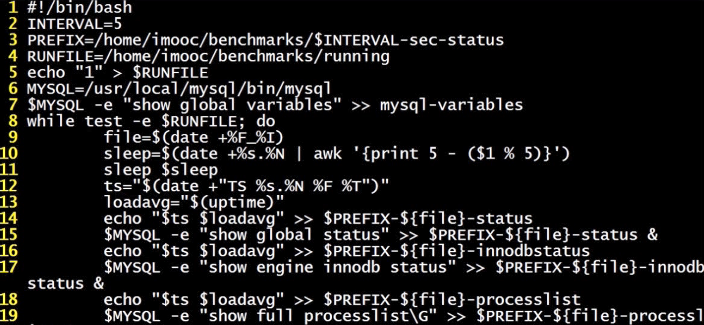
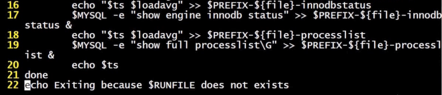
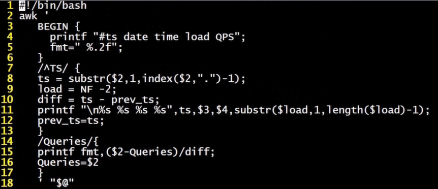

# 第三章：MySQL性能管理及架构设计-基准测试


## 前言

> 在优化mysql性能之前需要学习下基准测试以便对性能进行评估。基准测试不关注业务的逻辑，所使用的查询和业务的逻辑没有任何关系，而压力测试则是针对不同的主题，所使用的查询也是真实用到的数据。


## 如何进行基准测试

### 基准测试的目的

1. 建立Mysql服务器的性能基准线。确定当前Mysql服务器运行情况
2. 模拟比当前系统更高的负载， 以找出系统的拓展瓶颈增加数据库并发，观察QPS,TPS变化，确定并发量与性能最优关系
3. 测试不同的硬件、软件和操作系统配置
4. 证明新采购的硬件设备是否配置正确

### 如何进行基准测试

1. 对整个系统进行基准测试

   1. 能够测试整个系统性能，包括web服务器缓存、数据库
   2. 能够反映出系统中各个组件接口间的性能问题，体现真实性能情况
   3. 测试设计复杂，消耗时间长

2. 单独的对Mysql进行基准测试

   1. 测试设计简单，所需耗费时间短

   2. 无法全面了解整个系统的性能基准线

      ### 常见的指标

3. 单位时间内所处理的事务数（TPS）

4. 单位时间内处理的查询数（QPS）

5. 响应时间

   > 平均响应时间、最小响应时间、最大响应时间、各时间所占百分比，主要看百分比响应时间

6. 并发量,同时处理的查询请求的数量。正在工作中的并发的操作数或者和同时工作的数量

## 步骤

1. 对整个系统还是某一组件

2. 使用什么样的数据（生产环境的数据、生成的数据）

3. 准备基准测试以及数据收集脚本。CPU使用率、IO、网络流量、状态与计数器信息

   

   

   

4. 运行基准测试

5. 保存及分析基准测试结果

## 容易忽略的问题

1. 使用生产环境数据时只使用了部分的数据
2. 在多用户的场景中只做单用户的测试，推荐多线程并发测试
3. 在单服务器上测试分布式应用，推荐使用相同的架构
4. 反复执行同一查询，容易缓存命中，无法反映真实的查询性能。

## 基准测试工具

### mysqlslap

> mysql自带的基准测试工具，随mysql一起安装,缺点在于没有在自增id列上加上索引，对服务器的cup、IO、内存的测试体现不出来

#### 特点

1. 可以模拟服务器负载，并输出相关统计信息
2. 可以指定也可以自动生成查询语句

#### 常用参数说明

1. –auto-generate-sql 由系统自动生成sql脚本进行测试
2. –auto-generate-sql-add-autoincrement 在生成的表中增加自动ID
3. –auto-generate-load-type 指定测试中使用的查询类型
4. –auto-generate-sql-write-number 指定初始化数据时生成对的数据量
5. -concurrency指定并发线程的数量
6. –engine 指定测试表的存储引擎，可以使用逗号分割多个存储引擎
7. –no-drop 指定不清理测试数据
8. –iteratons 指定测试运行的次数
9. –number-of-queries 指定每个线程执行的查询的数量
10. –debug-info 指定输出额外的内存以及CPU统计信息
11. –number-int-cols 指定测试表中包含的int类型列的数量
12. –number-char-cols指定测试表中包含的varchar类型的数量
13. –create-schema 制定了用于执行测试的数据库的名称
14. –query 用于指定自定义sql的脚本
15. –only-print 并不运行脚本，而是把生成的脚本打印出来

#### 测试命令

```
mysqlslap -uroot -p --concurrency=1,50,100,200 --iterations=3 --number-int-cols=5 --number-char-cols=5 --auto-generate-sql --auto-generate-sql-add-autoincrement --engine=myisam,innodb --number-of-queries=10 --create-schema=sbtest
```

### sysbench

> 更为通用的测试工具，比mysqlslap更强大，使用方法可以自行查找