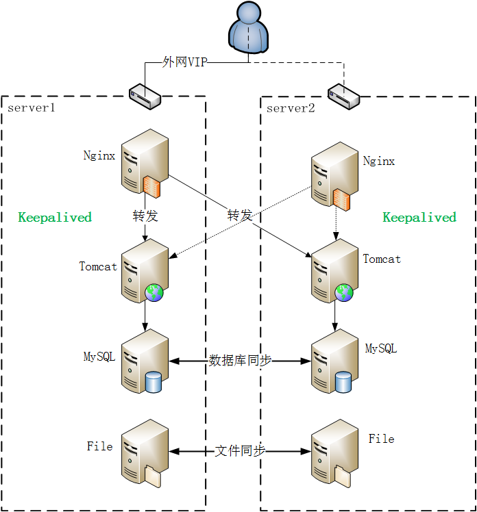
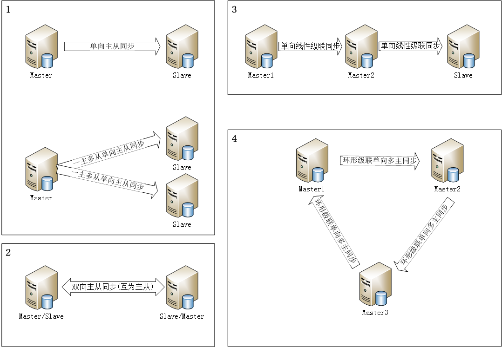

# 高可用双机系统方案

[TOC]

## 1 背景

目前IP升级系统都是单台服务器存在以下问题：
* a. 在升级过程中，服务器压力过大。
* b. 易发生单点故障。
* c. 数据无保障。
* d. 关键服务无监控，无告警等功能。

为解决上述问题，保障服务稳定运行，并根据现有的条件，设计了如下的方案。

## 2 方案介绍

本方案采用
1. Keepalived实现双机高可用
2. Nginx反向代理技术来实现服务器的负载均衡
3. MySQL的主从同步机制来保证数据库的同步
4. rsync+inotify来实现文件的同步功能
5. monit来监控关键服务的运行状态，保证关键服务的正常运行。

## 3 具体描述

### 3.1 架构描述
#### 3.1.1 架构图

#### 3.1.2 架构简介
> 此架构主要由keepalived实现双机高可用，需要一个外网VIP。

> 正常情况下，外网VIP和内网VIP都绑定在server1，web请求发送到server1的Nginx，Nginx将负载均衡到server1和server2.

> 当主服务器server1宕机时，keepalived检测到后，立即把外网VIP和内网VIP绑定到server2，此时Nginx不再把请求妆发给server1。

> 当server1恢复后，keepalived不抢占server2的VIP，继续正常服务。这时server2变成了主服务器。

#### 3.1.3 架构要求
1. 服务器需配备双网卡，同时配置内网和外网。
2. 需多加一个外网IP，用作VIP，且该外网IP不能绑定MAC

### 3.2 高可用
“高可用性”（High Availability）通常来描述一个系统经过专门的设计，从而减少停工时间，而保持其服务的高度可用性。

#### 3.2.1 KeepAlived介绍

keepalived顾名思义是保持存活，常用来搭建设备的高可用，防止业务核心设备出现单点故障。keepalived基于VRRP协议来实现高可用，主要用作realserver的健康检查以及负载均衡主机和backup主机之间的故障漂移。

它与Heartbeat实现的功能类似，都可以实现服务或者网络的高可用，但是又有差别：
1. 从安装、配置、使用、维护的角度上对比，KeepAlived 比 Heartbeat要简单得多
2. Heartbeat功能更强大，适合做大型集群管理。
3. 协议不同，Keepalive的使用VRRP协议进行通信和选举，Heartbeat使用心跳进行通信和选举，Heartbeat除了走网线外，还可以通过串口进行通信。
4. 使用方式上，Keepalived的脚本没有任何约束，而Heartbeat脚本有约束，需支持service start/stop/restart 这种方式。

> 使用建议：优先使用Keepalived，当Keepalived不够用时才选择Heartbeat。

#### 3.2.2 KeepAlived 主要功能

Keepalived的主要作用是检测服务器的状态，如果有一台web服务器死机，或工作出现故障，Keepalived将检测到，并将有故障的服务器从系统中剔除，同时使用其他服务器代替该服务器的工作，当服务器工作正常后Keepalived自动将服务器加入到服务器群中，实现自动剔除与恢复，不需要人工干涉，需要人工做的只是修复故障的服务器。 

keepalived一般用于实现前端高可用，且一般常用于两个节点的高可用（常见的前端高可用组合有LVS+Keepalived、Nginx+Keepalived、HAproxy+Keepalived）。

### 3.3 负载均衡器

对于数据流量过大的网络中，往往单一设备无法承担，需要多台设备进行数据分流，而负载均衡器就是用来将数据分流到多台设备的一个转发器。负载均衡器可分为软、硬件两种，本文只讨论软件负载均衡器。

Nginx 、LVS 、HAProxy是目前使用最广泛的三种负载均衡软件，一般对负载均衡的使用是随着网站规模的提升根据不同的阶段来使用不同的技术。具体的应用需求还得具体分析。

由于目前只有两台服务器，根据上面的对比情况，我们选择使用Nginx作为负载均衡器。

### 3.4 文件同步

#### 3.4.1 文件级别的同步
1. scp / sftp / nc 命令实现远程数据同步
2. 搭建 ftp / nfs 服务器，然后在客户端把数据同步到服务器
3. 搭建 samba 文件共享服务，然后在客户端把数据同步到服务器
4. 利用 rsync / lsyncd 等实现多机同步

#### 3.4.2 文件系统级别的同步
1.  DRBD (DistributedReplicatedBlockDevice) 是一个基于块设备级别在远程服务器直接同步和镜像数据的软件，用软件实现的、无共享的、服务器之间镜像块设备内容的存储复制解决方案。它可以实现在网络中两台服务器之间基于块设备级别的实时镜像或同步复制(两台服务器都写入成功)/异步复制(本地服务器写入成功)，相当于网络的RAID1，由于是基于块设备(磁盘，LVM逻辑卷)，在文件系统的底层，所以数据复制要比cp命令更快

  DRBD已经被MySQL官方写入文档手册作为推荐的高可用的方案之一

#### 3.4.3 rsync

优点：

与传统的cp、tar备份方式相比，rsync具有安全性高、备份迅速、支持增量备份等优点，通过rsync可以解决对实时性要求不高的数据备份需求，例如定期的备份文件服务器数据到远端服务器，对本地磁盘定期做数据镜像等。

不足：

rsync同步数据时，需要扫描所有文件后进行比对，进行差量传输。如果文件数量达到了百万甚至千万量级，扫描所有文件将是非常耗时的。而且正在发生变化的往往是其中很少的一部分，这是非常低效的方式。
其次，rsync不能实时的去监测、同步数据，虽然它可以通过linux守护进程的方式进行触发同步，但是两次触发动作一定会有时间差，这样就导致了服务端和客户端数据可能出现不一致，无法在应用故障时完全的恢复数据。

优化：

使用rsync+inotify组合可解决上面的不足。

#### 3.4.4 Lysncd 
Lysncd实际上是lua语言封装了 inotify 和 rsync 工具，采用了 Linux 内核（2.6.13 及以后）里的 inotify 触发机制，然后通过rsync去差异同步，达到实时的效果。

优点；

解决了 inotify + rsync海量文件同步带来的文件频繁发送文件列表的问题。
安装简单，使用lua进行配置，配置简单可读。

#### 3.4.5 rsync+inotify 与 lsyncd 比较
上述两种方案均和实现需求，具体性能对比暂未进行。

### 3.5 MySQL 同步

#### 3.5.1 MySQL 各种同步形式架构的逻辑图

1. 单向主从同步，此架构下只能在Master端进行数据写入

2. 双向主从同步，此架构下两端都可以进行数据写入

3. 线性级联单向双主同步，此架构只能在Master端进行数据写入

4. 环形级联单向多主同步，任意一点都可以写入数据

   > 说明：工作中最常用方案为”单向主从” “双向主从”同步架构。

#### 3.5.2 MySQL 主从复制的基本原理及过程

MySQL主从复制过程如下：

1. 在Slave 服务器上执行sart slave命令开启主从复制开关，开始进行主从复制。

2. 此时，Slave服务器的IO线程会通过在master上已经授权的复制用户权限请求连接master服务器，并请求从执行binlog日志文件的指定位置（日志文件名和位置就是在配置主从复制服务时执行change master命令指定的）之后开始发送binlog日志内容

3. Master服务器接收到来自Slave服务器的IO线程的请求后，其上负责复制的IO线程会根据Slave服务器的IO线程请求的信息分批读取指定binlog日志文件指定位置之后的binlog日志信息，然后返回给Slave端的IO线程。返回的信息中除了binlog日志内容外，还有在Master服务器端记录的IO线程。返回的信息中除了binlog中的下一个指定更新位置。

4. 当Slave服务器的IO线程获取到Master服务器上IO线程发送的日志内容、日志文件及位置点后，会将binlog日志内容依次写到Slave端自身的Relay Log（即中继日志）文件（MySQL-relay-bin.xxx）的最末端，并将新的binlog文件名和位置记录到master-info文件中，以便下一次读取master端新binlog日志时能告诉Master服务器从新binlog日志的指定文件及位置开始读取新的binlog日志内容

5. Slave服务器端的SQL线程会实时检测本地Relay Log 中IO线程新增的日志内容，然后及时把Relay LOG 文件中的内容解析成sql语句，并在自身Slave服务器上按解析SQL语句的位置顺序执行应用这样sql语句，并在relay-log.info中记录当前应用中继日志的文件名和位置点

### 3.6 系统监控
系统一旦上线跑起来我们希望它一直正常运行，但由于各种原因系统进程会挂掉或者系统资源占用过高，所以我们要监视系统的运行状况，发现问题及时处理。

#### 3.6.1 方案选择

系统监控有多种实现方式可选择。
1. 编写脚本监控系统进程及资源，并把监控脚本加到crontab里定时执行。
2. 采用系统监控软件，并配置监控任务进行监控。

在这里我们采用 monit 软件进行系统系统监控。

#### 3.6.2 monit 介绍

monit是一个开源的轻量级监控工具，功能十分强大。可以从多个层面进行监控，可以自动维护进程，发送邮件报警等。
	系统监控：进程状态，系统负载，cpu负载，内存占用等。
	进程监控：monit可以监控守护进程，当被监控进程异常退出时，可以自动被拉起。
	文件系统：Monit可以监控本地文件、目录、文件系统的变化，包括时间戳、校验值、大小的变化。例如，可以监控文件sha1以及md5的值，来监控文件是否发生变化
	网络监控：monit可以监控网络连接，支持TCP、UDP、Unix domain sockets以及HTTP、SMTP等。

#### 3.6.3 其他监控方案

**Supervisior**

	Supervisord是用Python实现的一款非常实用的进程管理工具，类似于monit。

**和monit的差异**

1. supervisord管理的进程必须由supervisord来启动，monit可以管理已经在运行的程序；
2. supervisord还要求管理的程序是非daemon程序，supervisord会帮你把它转成daemon程序，因此如果用supervisord来管理nginx的话，必须在nginx的配置文件里添加一行设置daemon off让nginx以非daemon方式启动。
3. Supervisior是基于python开发，且当前还不支持python3，而monit是基于C语言开发

## 参考资料
1. 构建高可用Linux服务器  余洪春  机械工业出版社
2. 高性能MySQL（第3版）Baron Schwartz 等 电子工业出版社
3. 构建高性能Web站点 郭欣 电子工业出版社

* MySQL双机热备配置步骤 https://www.zybuluo.com/Spongcer/note/69119
* mysql主从复制 http://blog.51cto.com/369369/790921
* Keepalived http://www.keepalived.org/index.html
* Heartbeat http://www.linux-ha.org/wiki/Heartbeat
* rsync https://rsync.samba.org
* lsyncd https://github.com/axkibe/lsyncd
* supervisor https://github.com/Supervisor/supervisor
* monit https://mmonit.com/monit/

